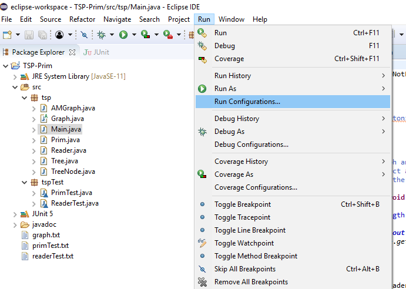
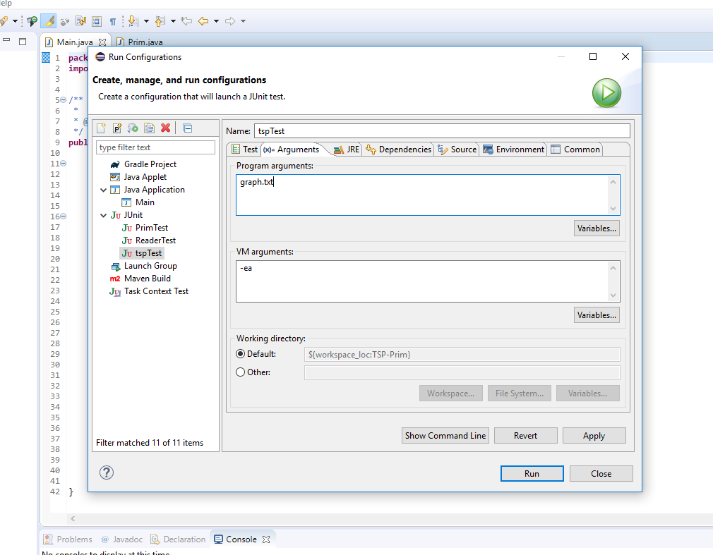
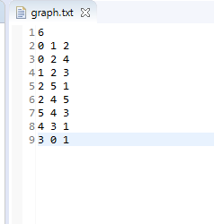
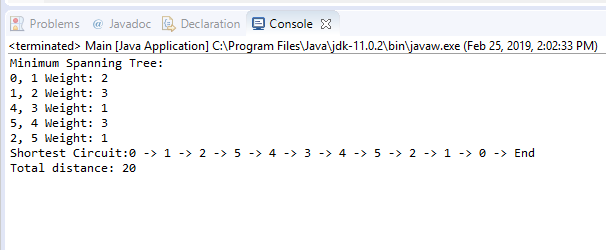
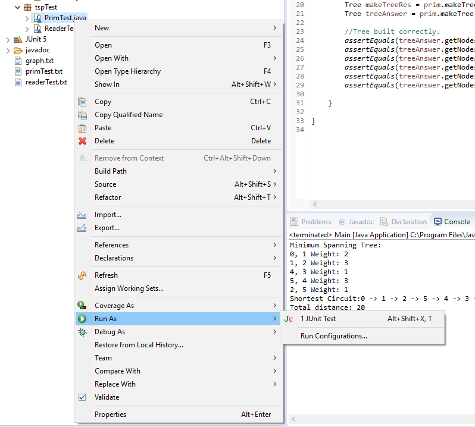
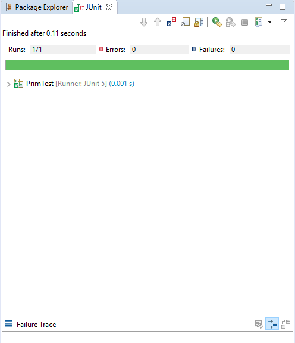
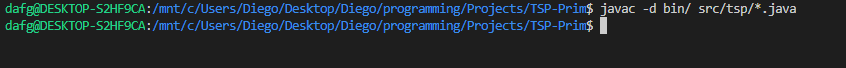
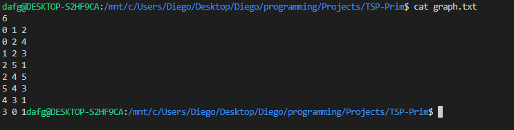
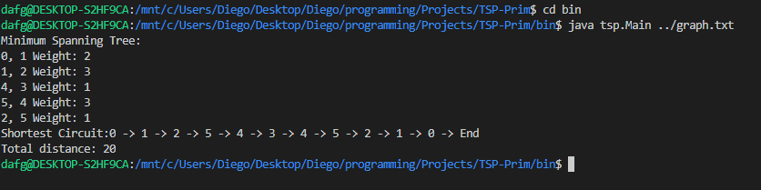

# Traveling Salesman Problem Approximation

This program is an approximation to the solution of the Traveling Salesman Problem. It consists of finding the most efficient circuit in a weighted, connected graph.
It is solved by creating a Minimum Spanning Tree and traversing it in pre-order, which will result in the most efficient circuit.

## Project structure

This is an Eclipse Java project. The src folder contains two packages, tsp and tspTest. The tsp package contains all the source code and the tspTest package contains unit tests created with the help of Eclipse's JUnit component, importing it is recommended to try out the tests. The program requires an input file containing the graph to be evaluated.

## Creating the Graph information

The program receives a file through command line. An example "graph.txt" is included. This file contains the graph to be evaluated, the format is as follows:
    
1. The first line is an integer representing the amount of vertices in the graph. 
2. The following lines contain three integers, representing the arcs information. It should be written as: 
   
   > Origin Destination Weight 
    
The parameters should be written in that same order, each one is an integer. The Origin and Destination are vertices in the graph and they are numbered in an interval depending on the size of the graph. In a graph with 10 vertices each will have a number assigned from 0 to 9, with no repeated numbers.
Weight is the cost to travel from one vertex to another.

## Running on Eclipse

To successfully run it on the Eclipse IDE import the project. On Run > Run Configurations > Arguments provide the filename of your graph information. The example information should be loaded.

Next up, run the main class and the output will be printed.

The tests classes are located on the tspTest package. To run the tests right-click on the tspTest package and run as > JUnit test. This will show the test results.

## Compiling the Source Code on a Terminal

To successfully run the program an updated Java Develpment Kit is needed, Official Oracle site for Java https://www.oracle.com/technetwork/java/javase/overview/index.html.
Next up, compile the source code, using this command:

   > $ javac -d bin/ src/tsp/*.java 

This will compile all of the source classes in its own package, tsp.

## Running the Program on a Terminal

After the graph information is ready, run the program as follows:

   >  $ cd bin

   >  $ java tsp.Main ../graph.txt

Where the argument is the name of the file containing the graph information. In this case the example, graph.txt, is included.
The output will show the shortest circuit and its overall cost.

## Examples

On this section a run example will be shown for both of the running methods.

### On Eclipse

To run on Eclipse, first set the argument on Run > Run Configurations > Arguments, as shown in the following images:

Adding arguments:

Input file:

After the argument is set, just select the Main class and run the project.

Program output:

## JUnit Tests

The tests are located on the tspTest package, to run them right click and select Run As > JUnit Test:

To check the test status look at the top left panel:

## On Terminal

To run on terminal we first compile the source code:

Next up, let's take a look at our input file:

Then we proceed to the bin directory and run the program:

